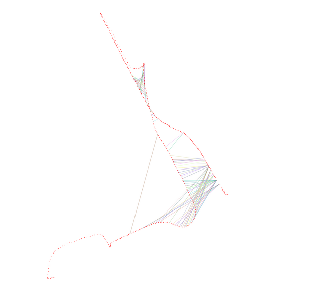

## NDD

The code for our paper accepted by  **IROS 2022** (NDD: A 3D Point Cloud Descriptor Based on Normal Distribution for Loop Closure Detection)

We present a global descriptor, named Normal Distribution Descriptor (NDD), for 3D point cloud loop closure detection. The descriptor encodes both the probability density score and entropy of a point cloud as the descriptor. We also propose a fast rotation alignment process and use correlation coefficient as the similarity between descriptors. 
### Related Paper

https://arxiv.org/abs/2209.12513

```
@INPROCEEDINGS { IROS-2022-Zhou,
  author = {Ruihao Zhou, Li He, Hong Zhang, Xubin Lin, Yisheng Guan},
  title = { NDD: A 3D Point Cloud Descriptor Based on Normal Distribution for Loop Closure Detection },
  booktitle = { Proceedings of the IEEE/RSJ International Conference on Intelligent Robots and Systems },
  year = { 2022 },
  month = { Oct. },
  address = { Japan }
}
```

### Demo
To run the demo, simply run NDD_demo.m.

Demo video can be found at: https://youtu.be/OYfp4tURhr0

### This Fork

This fork includes 

* a build system for the c++ code (cmake)
* an example that reads poses from a textfile, and pointcloud of your choosing, and visualizes the results

  

